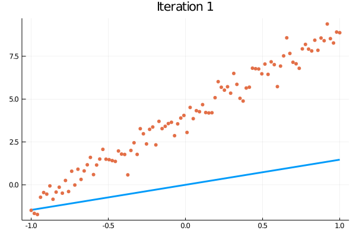

# tinygrad.jl

All small library for reverse-mode AD. Because it's okay to do things just for fun.

Operations are guaranteed to be atomic and eventually consistent (unless, of course, they aren't).

## Example
```julia
using tinygrad

n = 100
α = 1e-1
epochs = 40

f(x) = 5x + 4 #true
y(x) = f(x) + randn() * 0.5 #noised

ŷ(m,b,x) = m*x + b # estimate
loss(y,ŷ) = (y .- ŷ) .^ 2 |> x-> sum(x) / n # MSE loss

# make the training data (with pre-normalized inputs)
xs = range(-1.0; stop = 1.0, length = n) |> collect
ys = y.(xs)

m = abs(randn()) |> Diffable
b = 0 |> Diffable
    
for epoch in 1:epochs
    ŷ(x) = ŷ(m,b,x)

    ŷs = ŷ.(xs)
    
    currentloss = loss(ys, ŷs)
    backwards!(m)
    backwards!(b)

    m -= m.grad * α; clear!(m)
    b -= b.grad * α; clear!(b)
end
```


